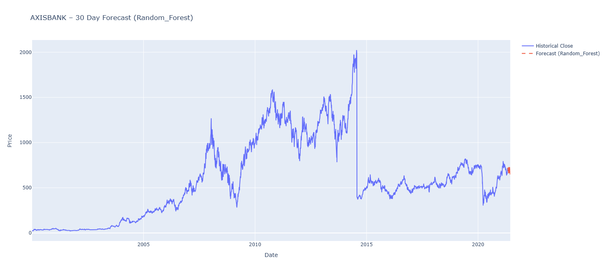

# 📈 Stock Price Forecasting for Top 10 Indian Stocks using ML Models

This project performs **time-series forecasting** on the **Top 10 Indian stocks**
using three different models:

- Auto-ARIMA
- Random Forest Regressor
- LSTM (Deep Learning)

Each model is evaluated using **RMSE**, and the **best-performing model** is selected
for every stock.

---

## 🚀 Project Overview

Financial time-series data is noisy, non-linear, and volatile.
This project benchmarks **statistical, machine learning, and deep learning models**
to identify the most effective approach for **30-day stock price forecasting**.

---

## 🔹 Forecast Horizon
- 30 Trading Days

## 🔹 Top 10 Stocks Analyzed
- TATAMOTORS
- SBIN
- ICICIBANK
- VEDL
- ITC
- HINDALCO
- TATASTEEL
- RELIANCE
- ZEEL
- AXISBANK

---
## 📊 Forecast Visualizations

.png)
.png)
.png)
.png)
.png)
.png)
.png)
.png)
.png)

**Legend**
- 🔵 Blue Line → Historical Closing Prices
- 🔴 Red Dashed Line → 30-Day Forecast
---
## 🧠 Models Used

### 1️⃣ Auto-ARIMA
- Traditional statistical time-series model
- Captures trend and seasonality
- Struggles with high volatility

### 2️⃣ Random Forest Regressor
- Ensemble machine learning model
- Handles non-linearity and feature interactions well
- Strong performance across most stocks

### 3️⃣ LSTM (Long Short-Term Memory)
- Deep learning model for sequential data
- Effective for long-term dependencies
- Requires more data and tuning

---

## 📊 Model Performance Comparison (RMSE)

| Index | Stock       | Auto-ARIMA RMSE | Random Forest RMSE | LSTM RMSE | Best Model |
|------:|------------|----------------:|-------------------:|----------:|-----------|
| 0 | TATAMOTORS | 293.03 | **7.19** | 13.46 | Random Forest |
| 1 | SBIN | 57.82 | **8.23** | 17.55 | Random Forest |
| 2 | ICICIBANK | 145.15 | **10.56** | 17.50 | Random Forest |
| 3 | VEDL | 80.72 | **5.68** | 22.64 | Random Forest |
| 4 | ITC | 42.01 | **4.83** | 31.07 | Random Forest |
| 5 | HINDALCO | 57.54 | 20.90 | **11.85** | LSTM |
| 6 | TATASTEEL | 153.24 | **14.70** | 22.23 | Random Forest |
| 7 | RELIANCE | 489.57 | **43.00** | 80.18 | Random Forest |
| 8 | ZEEL | 1561.85 | **13.47** | 16.47 | Random Forest |
| 9 | AXISBANK | 175.61 | **15.19** | 32.59 | Random Forest |

---

## 🏆 Key Results & Insights

- **Random Forest outperformed all models for 9 out of 10 stocks**
- **LSTM performed best only for HINDALCO**
- Auto-ARIMA showed significantly higher error due to:
  - Market volatility
  - Non-stationary behavior
- Machine learning models handled:
  - Non-linear patterns
  - Sudden price movements
  - Feature interactions more effectively

---

## 📌 Final Conclusion

> **Random Forest is the most reliable and consistent model for short-term
stock price forecasting across multiple Indian equities.**

---

## 🛠️ Tech Stack

- **Language:** Python
- **Libraries:**
  - Pandas, NumPy
  - Scikit-learn
  - TensorFlow / Keras (LSTM)
  - Statsmodels / pmdarima (Auto-ARIMA)
  - Matplotlib, Seaborn
- **Environment:** Jupyter Notebook

---

## ⚠️ Disclaimer

This project is for **educational and research purposes only**.
It does **not constitute financial or investment advice**.
